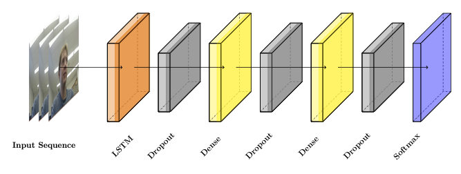
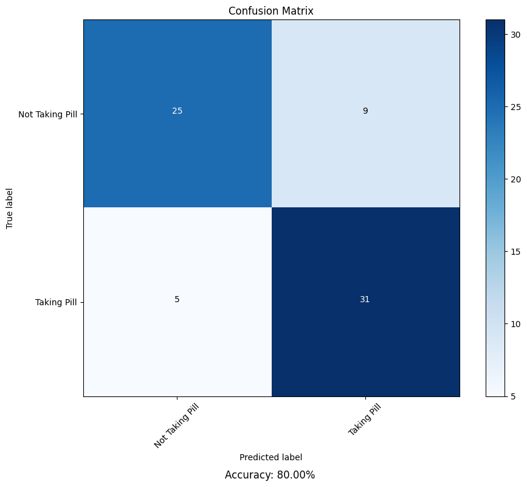
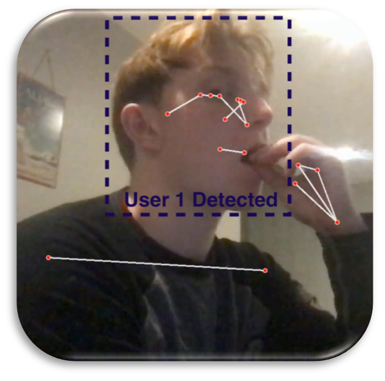

# Computer Vision for AI Medication Managmement System

## Overview

This project presents a secure, AI-powered smart pillbox system that ensures reliable medication adherence using:

- **Facial recognition** for user identity verification.
- An **LSTM-based model** for pill intake detection using pose estimation.

The system includes modules for:
- Video processing
- Real-time prediction
- Client-server communication
- Model training

---

## Features

### 1. Facial Recognition
- Implements DeepFace with DLIB backend.
- Compares 1-second live video snapshots to a stored profile image.
- Prevents unauthorized access with over **90% identity verification accuracy**.

### 2. Pill Intake Detection
- Uses a custom LSTM model trained on **MediaPipe pose landmarks**.
- Classifies actions from **10-second video clips**.
- Achieved **~85% accuracy** on a dataset of 500+ samples.

### 3. Model Architecture
- **1 LSTM Layer (128 units)**
- **2 Dense Layers (128 units each)**
- **Dropout (0.3)** for regularization
- **Sigmoid output** for binary classification



---

## Installation

### Dependencies

Install required Python packages:

```bash
pip install keras tensorflow opencv-python mediapipe deepface scikit-learn matplotlib paramiko keyboard
```

---

## Directory Structure

```
ComputerVision/
├── Record_Predict.py                  # Main CV pipeline for real-time detection
├── Pill_Prediction_DeepLearning.ipynb # Training script for LSTM model
├── SocketServer-Host.py              # Remote host server implementation
├── SocketServer-Client.py            # BeagleBone/Edge client-side code
├── images/
│   ├── landmark_example.png           # Pose estimation & facial recognition illustration
│   ├── model_architecture.png         # Model architecture diagram
│   └── confusion_matrix.png           # Classification performance visualization
├── models/
│   └── pill_classifier.keras          # Saved trained model
└── README.md
```

---

## Training the Model

Run `Pill_Prediction_DeepLearning.ipynb` from Jupyter Notebook.

### Key Steps:
- Loads and preprocesses pose landmarks from `.mp4` videos.
- Applies data augmentation (flip, noise).
- Trains an LSTM model on sequence data with class re-weighting.
- Saves the trained model to `models/pill_classifier.keras`.
- Generates **Confusion Matrix** and **Loss/Accuracy Plots**.



---

## Real-Time Execution

Use `Record_Predict.py` for real-time verification:

```bash
python Record_Predict.py
```

- Streams webcam feed using the `VideoStream` class.
- Verifies identity using **DeepFace**.
- Extracts pose landmarks with **MediaPipe**.
- Predicts pill intake using the trained **LSTM model**.

### Example Pose Landmarking Output



---

## Client-Server Deployment

### 1. Start Host Server:
```bash
python SocketServer-Host.py
```

### 2. Start Client on BeagleBone:
```bash
python SocketServer-Client.py
```

The server sends `START_MAIN` or `START_FACEID` signals based on key input.

---

## Performance

### Facial Recognition:
- **90% accuracy** across 10 trials.
- **0 false positives** (no unauthorized access).

### Pill Classification:
- **80% test accuracy**.
- Some misclassifications, primarily false positives.

---

## Future Improvements

- Expand dataset for better generalization.
- Implement user feedback on false classifications.
- Integrate pill dispensation logging and cloud syncing.


---


## Contributors

Josh Visser
University of Guelph, Capstone Project

---

For complete functionality and additional customization, refer to the scripts in this repository.
