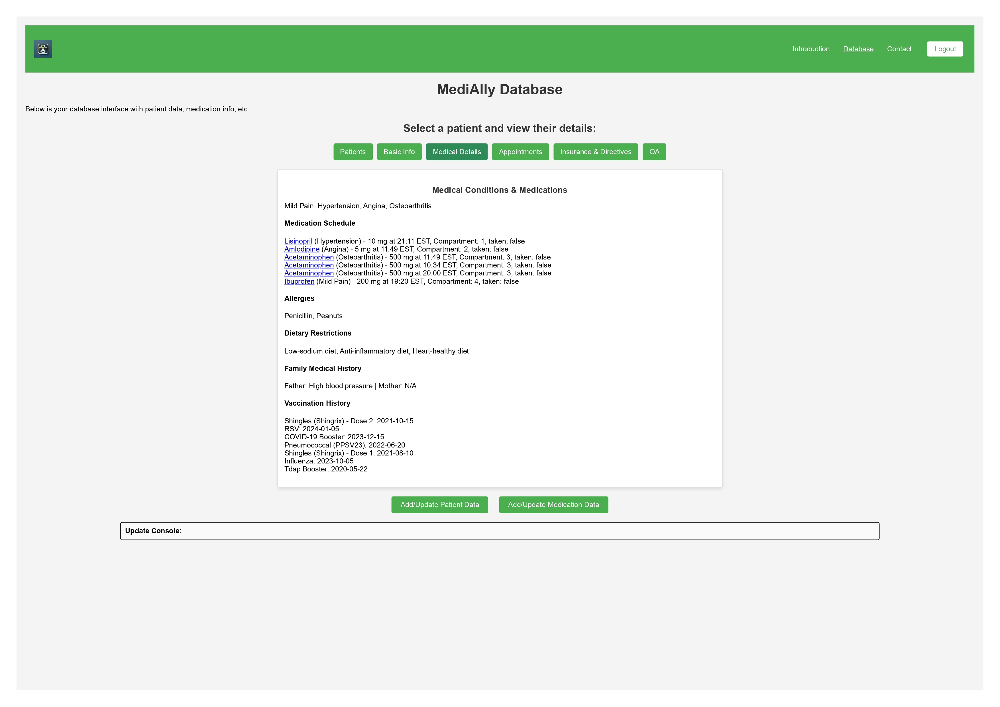

# Firebase - Smart Pillbox & Medication Assistant

This project is a **secure, web-based Smart Pillbox and Medication Assistant** that uses **Firebase** as its backend service. It is designed to assist healthcare workers in securely managing and updating patient and medication information in real time. Built with a focus on **patient safety**, **data privacy**, and **usability**, the system enables seamless access through a modern web interface.

---

## 🔧 Features

- 🔐 **Secure Authentication** using Google Sign-In and 2-Factor Authentication (2FA)
- 🌐 **Web Interface** for accessing and updating patient and medication data
- 🩺 **Real-Time Database (Firebase Realtime/Firestore)** to manage patient data dynamically
- ⚙️ **Role-Based Access Control** using Firebase security rules
- 📝 **Form-Based UI** to easily add/update data entries
- 📜 **Activity Console** for tracking updates and communications
- ✅ **Compliance** with GDPR, CCPA, CPRA
- 🛡️ **Certified for Security**: ISO 27001, 27017, 27018, SOC 1/2/3

---

## 🗂️ Firebase Integration

### 🔒 Authentication
- Sign-in is enabled through **Google Sign-In**
- Enforced **Two-Factor Authentication (2FA)**
- Only **authorized healthcare employees** can access the application

### 📁 Firestore Database Structure
- Patient data stored in **collections** and **documents**
- Includes data like:
  - Personal info (DOB, physician, conditions)
  - Medication schedule and dosage
  - Communication logs
- Firebase **rules** restrict access to authenticated users only

### 🔐 Security & Privacy
- All data is **encrypted at rest and in transit**
- Access logs and console activity help maintain accountability
- Firebase Authentication handles:
  - Email, password
  - Phone number and IP for security
- Backend access is strictly gated via Firebase Console with 2FA

---

## 📊 Frontend Overview

- Built with **HTML**, **CSS**, and **JavaScript**
- Navigation allows filtering by **patient tabs**
- **Dynamic Forms** allow adding/updating of data
- Backend activity is reflected on a console for transparency
- Patient data is presented in a clear, categorized format

### Frontend Preview



---

## 🛡️ Compliance and Certifications

| Regulation | Description |
|-----------|-------------|
| **GDPR** | Protects EU resident data through strict record-keeping, DPO roles, and PHI access rights |
| **CCPA** | Gives California residents rights to view, delete, and restrict use of their personal data |
| **CPRA** | Extends CCPA with data correction and usage limitations |
| **ISO 27001** | Information Security Management certification |
| **ISO 27017** | Cloud-specific data protection guidelines |
| **ISO 27018** | Protects Personally Identifiable Information (PII) in public cloud systems |
| **SOC 1, 2, 3** | Audit reports focused on security and system controls |

---

## Installation

Imports are done directly through Firebase CDN URLs, therefore, no dependencies need to be installed to develop the Frontend.
The following steps outline the process to build a Firestore Database and Frontend Website using JS, HTML, CSS, and Python:

1. Sign in to your **Google Account** and create a project using the following link: https://console.firebase.google.com/u/0/
2. Create a **Firestore Database** and set the following rules to allow only authenticated users to read and write in the database.

```
rules_version = '2';

service cloud.firestore {
  match /databases/{database}/documents {
    // Allow authenticated users to read and write all documents in all collections
    match /{document=**} {
      allow read, write: if request.auth != null;
    }
  }
}
```
3. Set up **Authentication** in Firebase by enabling either **Email/Password** or **Google Sign-In methods**. Then enter the identified user.
4. Create a **Web App** and copy the following information which will be unique to your project:

```js
const firebaseConfig = {
  apiKey: " ",
  authDomain: " ",
  projectId: " ",
  storageBucket: " ",
  messagingSenderId: " ",
  appId: " ",
  measurementId: " "
};
```
This information will be needed in **app.js** and **test.html**

5. Download **index.html**, **app.js**, **dashboard.html**, **test.html**, **contact.html**, and **style.css**
6. Using **Visual Studio Code**, open and run **index.html** with **Live Server**

### Dependencies

For applications that utilize **Python** for **accessing**, **retrieving**, or **updating** information in the **Firestore Database**, the following depencies should be installed:

```bash
pip install firebase-admin pytz
```
A service account will need to be created and a new private key will need to be generated, which will look like the following:

```py
import firebase_admin
from firebase_admin import credentials

cred = credentials.Certificate("path/to/serviceAccountKey.json")
firebase_admin.initialize_app(cred)
```

Example code on how to access, retrieve, or update information in the Firebase Database can be seen in db.py. Ensure the above **Service Account Key** is included for access.

---

## Contributors
Zohaib Saghir - University of Guelph, Capstone Project
